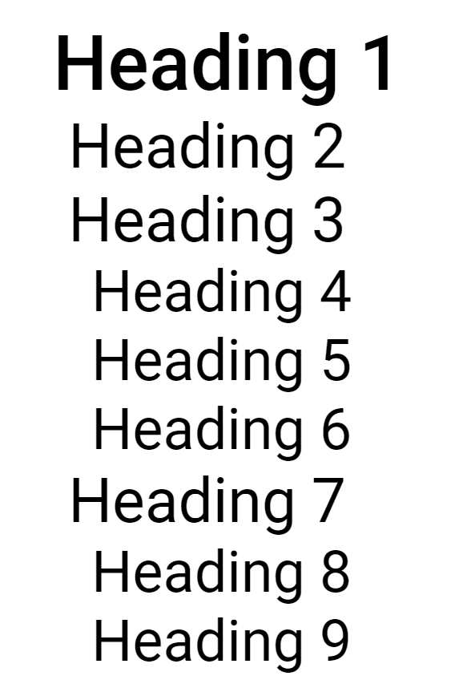

# Typography CSS library
**Author:** *Vojtěch Suchánek* <br>

## Demo site
Link to **[demo](https://pslib-cz.github.io/2021l4web-typographic-library-vojtechsuchanek/)** site for preview.
## Dependecies
### Include CSS and Javascript files in head
```js
<head>
    //Script for creating list of headings
    <script src="../src/classes.js"></script>
    
    //Stylesheet for default page look 
    <link rel="stylesheet" href="../src/style.css">
</head>
```
## Implementation
You have to create div, with id that you will refer in your script soon.
```html
<div id="content"></div>
```
After that you need to initialize the script.
```js
<script>
    new content(document.getElementById("content"), 
    [
    document.getElementsByTagName("h1"), /* Selector level 1 */
    document.getElementsByTagName("h2"), /* Selector level 2 */
    document.getElementsByTagName("h3")  /* Selector level 3 */
    //... you can use up to 5 selectors
    ])
</script>
```
## Usage
This script is useful if you need to browse the headings in your document and then scroll through them.